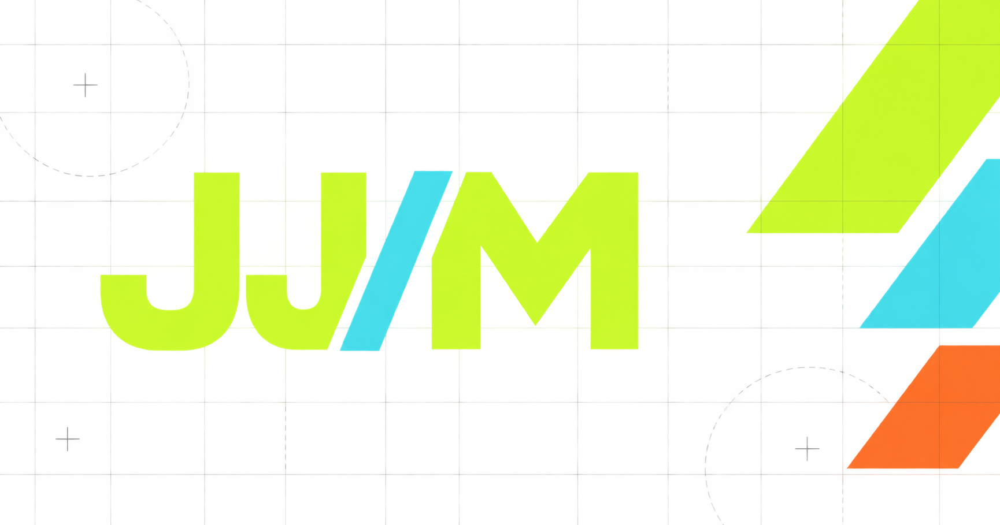

## JungMyung Jang Portfolio 👋

순수 HTML, CSS, JavaScript로 제작한 반응형 개발자 포트폴리오이다. 자기소개와 기술 스택, GitHub 프로젝트 목록, 문의 폼을 제공한다. 사용자 이벤트 → 상태 변경 → DOM 업데이트 흐름을 직접 구현하는 것이 핵심 학습 목표이다.

[Visit My Portfolio](https://codyssey-jjm.github.io/codyssey-b1-1/)



## 주요 기능

- Hero, About, Skills, Projects, Contact, Footer로 구성한 단일 페이지이다.
- 모바일·태블릿·데스크톱에 대응하는 반응형 레이아웃이다.
- 햄버거 메뉴, 내부 앵커 이동, 스크롤 탑, 헤더 배경 변경을 제공한다.
- 라이트·다크 모드와 localStorage 기반 설정 유지를 제공한다.
- 사용자 저장값이 없으면 시스템 테마를 감지한다.
- 스크롤 등장 애니메이션과 Hero 타이핑 효과를 제공한다.
- GitHub 개인·조직 저장소에서 지정 프로젝트를 가져와 카드를 생성한다.
- 개발 분야·주 사용 언어·진행 상태 필터와 프로젝트 개수를 제공한다.
- 프로젝트 조회의 로딩·성공·오류·빈 결과와 재시도 UI를 제공한다.
- 문의 폼의 필수값·이메일 검증과 Formspree 전송을 제공한다.
- 키보드 탐색, 상태 알림, 모션 감소 설정을 고려한 인터랙션이다.

## 사용 기술

| 기술 | 용도 |
| --- | --- |
| HTML5 | 시맨틱 구조, 앵커, 폼, 접근성 속성 |
| CSS3 | CSS 변수, Flexbox, Grid, 반응형 레이아웃, 테마·전환 효과 |
| JavaScript ES Modules | DOM 조작, 이벤트, 기능별 상태와 렌더링 |
| Fetch API·async/await | GitHub 조회와 Formspree 전송 |
| localStorage·matchMedia | 테마 유지와 시스템·모션 설정 감지 |
| Intersection Observer | 화면 진입 애니메이션 |
| GitHub REST API | 저장소 정보 조회 |
| Formspree | 문의 내용 전송 |
| Paperlogy 웹 폰트 | CDN에서 로드하는 서체 |
| GitHub Pages | 정적 사이트 배포 대상 |

외부 UI 라이브러리와 프레임워크는 사용하지 않는다. Skills와 Projects에 표시하는 React, Spring, Flutter 등은 소개하는 역량과 개별 프로젝트의 기술이다.

## 프로젝트 구조

```text
.
├── index.html                 # 페이지 구조와 외부 파일 연결
├── css/
│   ├── style.css              # CSS import 진입점
│   ├── tokens.css             # 색상·글꼴·간격·테마 변수
│   ├── base.css               # 기본 스타일
│   ├── components.css         # 공통 요소
│   ├── effects.css            # 전역 효과와 모션 감소
│   └── sections/              # 섹션별 스타일
├── js/
│   ├── main.js                # 기능 초기화
│   ├── features/
│   │   ├── navigation.js      # 메뉴와 앵커 이동
│   │   ├── scroll.js          # 헤더와 스크롤 탑
│   │   ├── theme.js           # 테마와 설정 저장
│   │   ├── reveal.js          # 스크롤 등장 효과
│   │   ├── typing.js          # Hero 타이핑
│   │   ├── contact/           # 폼 상태와 검증
│   │   └── projects/          # 요청 상태·데이터 가공·렌더링
│   ├── services/              # GitHub·Formspree 요청
│   └── shared/                # 미디어 쿼리와 공통 스크롤 정책
├── images/                    # 프로필 자리 표시자와 OG 이미지
├── favicon/                   # 아이콘과 웹 매니페스트
├── docs/                      # 구조 설명 문서
├── plan/                      # 미션과 개발 계획·기록
├── review.md                  # 미션 기준 발표·설명 자료
└── README.md                  # 프로젝트 소개와 사용 안내
```

## 반응형·인터랙션 기준값

| 항목 | 현재 값 | 설정 위치 |
| --- | --- | --- |
| 태블릿 레이아웃 | `48rem` 이상, 기본 글꼴 16px 기준 768px | `css/tokens.css`, `css/sections/` |
| 데스크톱 레이아웃 | `64rem` 이상, 기본 글꼴 16px 기준 1024px | `css/tokens.css`, `css/sections/` |
| 데스크톱 메뉴 전환 | `64rem` 이상 | `js/shared/media.js`, `css/sections/header.css` |
| 헤더 배경 변경 | 스크롤 위치 `60px` 이상 | `js/features/scroll.js` |
| 스크롤 탑 표시 | 스크롤 위치 `300px` 이상 | `js/features/scroll.js` |
| 스크롤 탑 숨김 지연 | `200ms` | `js/features/scroll.js` |
| 등장 감지 threshold | `0.2` | `js/features/reveal.js` |
| 등장 감지 rootMargin | `0px 0px -10% 0px` | `js/features/reveal.js` |
| 타이핑 시작 지연·글자 간격 | `450ms`·`55ms` | `js/features/typing.js` |
| 테마 저장 키 | `portfolio-theme` | `js/features/theme.js` |

테마는 저장된 사용자 선택을 우선하고, 저장값이 없으면 시스템 설정을 따른다. 모션 감소 설정에서는 스크롤을 즉시 이동하며, 타이핑과 초기 등장 효과도 전체 내용을 바로 표시하는 방식으로 처리한다.

## GitHub 프로젝트 데이터

조회 대상은 `jungmyung16` 개인 계정과 `gameDev-graphics-Lab` 조직이다. 설정 위치는 `js/services/github.js`이다.

```text
GET https://api.github.com/users/jungmyung16/repos?sort=updated&direction=desc&per_page=100&type=owner
GET https://api.github.com/orgs/gameDev-graphics-Lab/repos?sort=updated&direction=desc&per_page=100&type=public
```

두 요청을 병렬 수행한 뒤 응답을 합친다. `js/features/projects/repository.js`의 `FEATURED_REPOSITORIES`에 지정한 다음 저장소만 응답에서 찾아 순서대로 표시한다.

| 분야 | 저장소 | 로컬 진행 상태 |
| --- | --- | --- |
| 웹 | `jungmyung16/CatdogEats-FE` | 완료 |
| 웹 | `jungmyung16/CatdogEats-BE` | 완료 |
| 웹 | `jungmyung16/Shipment-Simulator` | 완료 |
| 앱 | `jungmyung16/WeatherApp-with-Flutter` | 완료 |
| 게임 | `gameDev-graphics-Lab/ComputerGraphics_Project` | 완료 |
| 게임 | `gameDev-graphics-Lab/VamSurvialLike_Game` | 완료 |
| 게임 | `gameDev-graphics-Lab/EscapeDungeon` | 완료 |
| 게임 | `gameDev-graphics-Lab/UnrealTPS` | 완료 |

카드의 이름·설명·주 사용 언어·별 수·갱신일은 API 응답을 사용한다. 분야·기술 태그·진행 상태는 로컬 설정이다. 언어가 없으면 `Other`로 분류한다. 실제 표시 개수는 API 응답에 포함된 지정 저장소 수에 따라 달라진다.

분야 → 언어 → 진행 상태 순서로 필터링한다. 상위 필터 변경 시 하위 선택값을 초기화하고, 필터 변경에 따른 추가 API 요청은 없다. Hero의 분야 카드도 프로젝트 분야 선택과 연결한다.

요청 중에는 로딩 문구와 효과, 성공 시에는 카드, 실패 시에는 오류 안내와 재시도 버튼을 표시한다. 표시 대상이 없으면 빈 상태를 표시하고, 필터 결과가 없으면 별도의 안내 문구를 표시한다.

인증 토큰은 사용하지 않는다. 미션은 비인증 요청 한도를 시간당 60회로 안내하므로 반복 새로고침을 피한다. 현재 로딩 한 번당 두 API 요청을 보내며, 두 요청 중 하나라도 실패하면 전체 오류로 처리한다. 첫 페이지 조회만 구현되어 있어 각 소스의 100개 범위 밖에 있는 저장소는 표시되지 않는다.

## 문의 폼

이름·이메일·메시지를 필수값으로 검사한다. 빈 값과 공백만 있는 값은 허용하지 않으며, 이메일은 정규식으로 기본 형식을 검사한다. 오류는 해당 필드 근처에 표시하고, 제출 오류 시 첫 오류 필드로 포커스를 이동한다.

전송 주소는 `index.html`의 문의 폼 `action`에 설정한다. 현재 값은 `https://formspree.io/f/moeqyzel`이다. 포트폴리오를 복제해 사용할 때는 자신의 Formspree 주소로 변경한다.

검증을 통과하면 `FormData`를 POST로 전송한다. 전송 중에는 중복 제출을 차단하고, 성공하면 입력값을 초기화한다. 실패하면 입력값을 유지하고 재전송할 수 있도록 한다. 화면의 성공 메시지는 HTTP 성공 응답을 기준으로 하며 실제 메일 수신까지 확인한 결과는 아니다.

## 배포와 제출 확인

배포 대상은 GitHub Pages이다. 빌드 산출물 대신 `index.html`과 CSS·JavaScript·이미지 파일을 포함한 정적 파일을 제공하는 구조이다. 실제 저장소의 Pages 게시 설정과 배포 성공 여부는 GitHub에서 확인할 항목이다.

아래 목록은 사용자가 수행할 확인 항목이며, 문서 작성 과정에서 통과한 테스트 목록은 아니다.

- [ ] 배포 URL 접속과 CSS·JavaScript·이미지의 정상 로딩을 확인한다.
- [ ] 모바일·태블릿·데스크톱의 레이아웃과 메뉴 전환을 확인한다.
- [ ] 메뉴 토글, 앵커 이동, 헤더 배경, 스크롤 탑을 확인한다.
- [ ] 테마 변경과 새로고침 후 유지, 시스템 테마 우선순위를 확인한다.
- [ ] 등장 효과·타이핑·모션 감소 설정을 확인한다.
- [ ] GitHub 로딩·성공·오류·빈 상태, 필터와 재시도를 확인한다.
- [ ] 폼 검증·전송 실패 시 입력 유지·전송 성공과 실제 메일 수신을 확인한다.
- [ ] 데스크톱·모바일·다크 모드 스크린샷을 추가한다.
